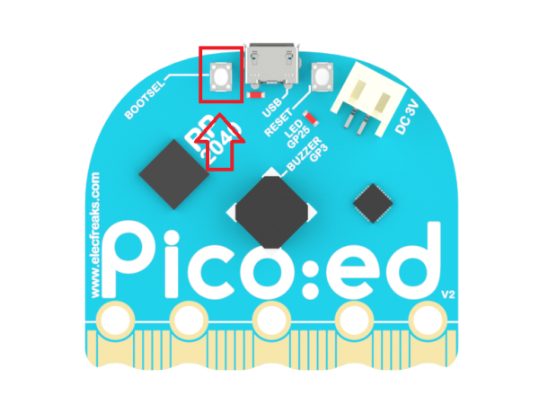
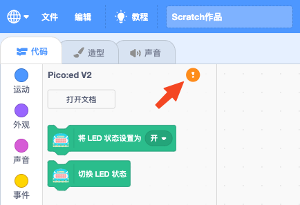

# Pice:ed V2

Pico:ed V2 开发板是恩孚科技基于树莓派 Pico 而开发的一款教育开发板。用了广受好评的 RP2040 微控制器，在一代的基础上我们特别加入了一个复位按钮，更方便使用者的操作使用。采用更加圆润的外形：头部改变为弧形，引脚边缘采用波浪形设计，这样让使用者在使用时不易伤手。保留两个可编程按钮和固件烧录按钮，单独的供电接口和 USB 连接接口，板载 7×17 LED点阵屏，可以显示更多的图案和文字。

## 认识 Pico:ed V2

详细查看《[恩孚科技 Pico:ed V2 产品帮助手册](https://www.yuque.com/elecfreaks-learn/picoed/ig010b)》，购买地址：[淘宝链接](https://item.taobao.com/item.htm?id=680221594556)。

| 正面 | 背面 |
| :---: | :---: |
|  |  |

## Pico:ed V2 扩展

Pico:ed V2 扩展是基于 Scratch 3.0 开发的扩展模块，可以让 Scratch 3.0 具备对 Pico:ed V2 开发板进行开发的功能。

### 编程方式

使用扩展对 Pico:ed V2 开发板进行实时编程或离线编程（暂未开放），在实时编程时可以及时看到运行效果并能与电脑进行交互；实时编程完成后直接下载到 Pico:ed V2 开发板中就可以离线运行，离线运行可以不用连接电脑，但也失去了与电脑的交互能力。

### 固件

要求 Pico:ed V2 开发板使用支持树莓派 Pico 的标准 MicroPython 固件，可以通过 MicroPython 官网进行下载，[下载链接](https://micropython.org/download/rp2-pico/)。

#### 拖放安装固件

下载好固件后，将 Pico:ed V2 开发板准备好（不要连接电脑 USB 接口），然后按下面的步骤安装固件：

1. 按住 Pico:ed V2 开发板背面的 BOOTSEL 按钮，然后将 Pico:ed V2 开发板插入 PC 的 USB 接口，然后松开 BOOTSEL 按钮。
2. Pico:ed V2 开发板会被识别为大容量存储设备。
3. 将下载的 MicroPython 固件文件（UF2 文件）放入 RPI-RP2 卷上。
4. Pico:ed V2 开发板将自动重启，然后 MicroPython 就开始运行了。

接下来就可以使用 Pico:ed V2 扩展对 Pico:ed V2 开发板进行编程了。

## 连接 Pico:ed V2

| 点击感叹号开始连接 | 选择 Pico:ed V2 开发板 |
| :---: | :---: |
|  |  |

现在开始享受愉快的编程吧！
