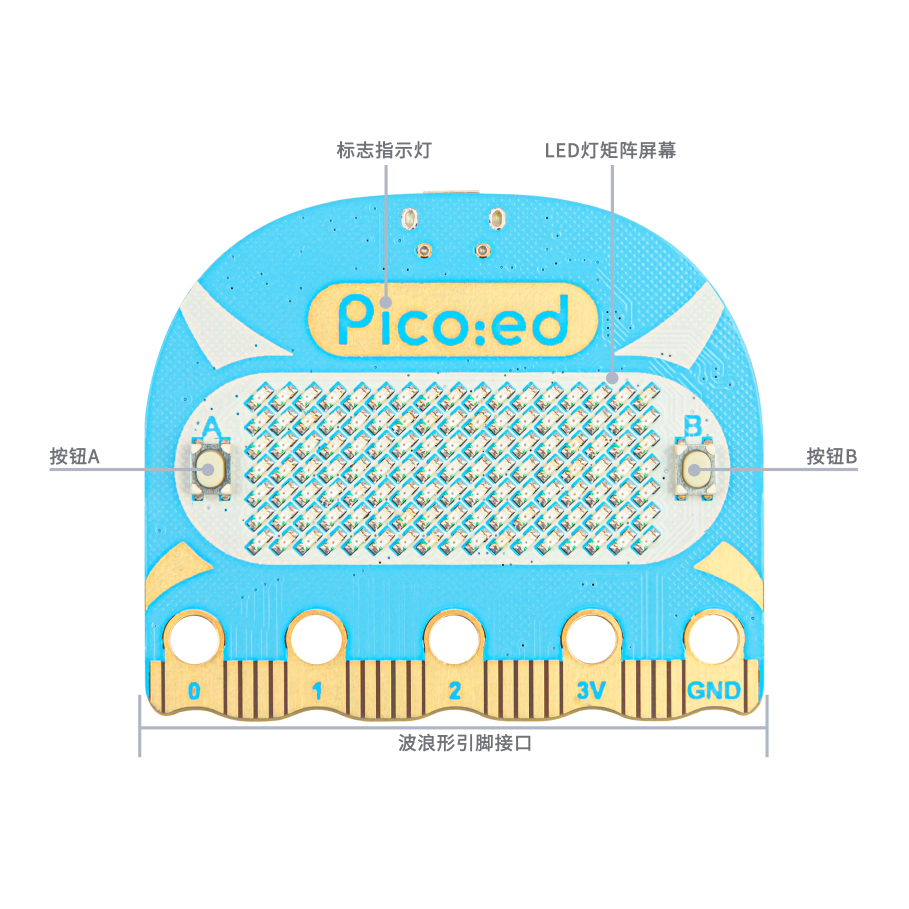
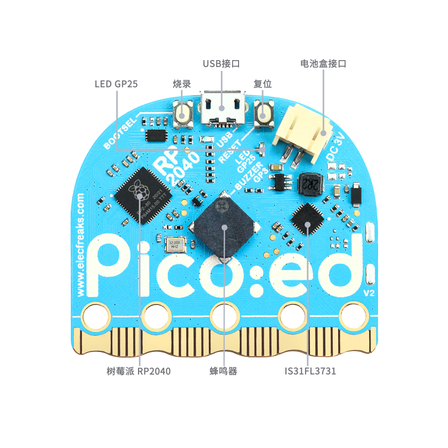
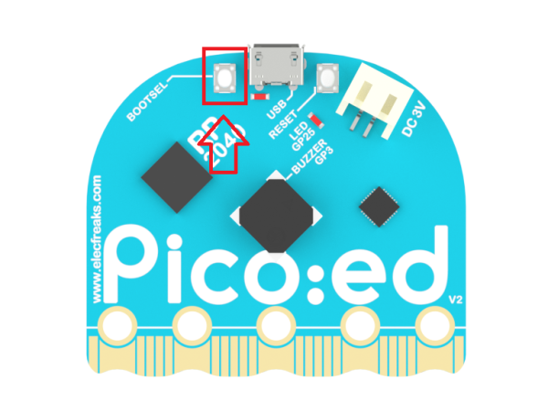

# Pice:ed V2

Pico:ed V2 開發板是恩孚科技基於樹莓派 Pico 而開發的一款教育開發板。用了廣受好評的 RP2040 微控制器，在一代的基礎上我們特別加入了一個復位按鈕，更方便使用者的操作使用。採用更加圓潤的外形：頭部改變為弧形，引腳邊緣採用波浪形設計，這樣讓使用者在使用時不易傷手。保留兩個可編程按鈕和固件燒錄按鈕，單獨的供電接口和 USB 連接接口，板載 7×17 LED點陣屏，可以顯示更多的圖案和文字。

## 認識 Pico:ed V2

詳細查看《[恩孚科技 Pico:ed V2 產品幫助手冊](https://www.yuque.com/elecfreaks-learn/picoed/ig010b)》，購買地址：[淘寶鏈接](https://item.taobao.com/item.htm?id=680221594556)。

| 正面 | 背面 |
| :---: | :---: |
|  |  |

## Pico:ed V2 擴展

Pico:ed V2 擴展是基於 Scratch 3.0 開發的擴展模塊，可以讓 Scratch 3.0 具備對 Pico:ed V2 開發板進行開發的功能。

### 編程方式

使用擴展對 Pico:ed V2 開發板進行實時編程或離線編程（暫未開放），在實時編程時可以及時看到運行效果並能與電腦進行交互；實時編程完成後直接下載到 Pico:ed V2 開發板中就可以離線運行，離線運行可以不用連接電腦，但也失去了與電腦的交互能力。

### 固件

要求 Pico:ed V2 開發板使用支持樹莓派 Pico 的標準 MicroPython 固件，可以通過 MicroPython 官網進行下載，[下載鏈接](https://micropython.org/download/rp2-pico/)。

#### 拖放安裝固件

下載好固件後，將 Pico:ed V2 開發板準備好（不要連接電腦 USB 接口），然後按下面的步驟安裝固件：

1. 按住 Pico:ed V2 開發板背面的 BOOTSEL 按鈕，然後將 Pico:ed V2 開發板插入 PC 的 USB 接口，然後鬆開 BOOTSEL 按鈕。
2. Pico:ed V2 開發板會被識別為大容量存儲設備。
3. 將下載的 MicroPython 固件文件（UF2 文件）放入 RPI-RP2 捲上。
4. Pico:ed V2 開發板將自動重啟，然後 MicroPython 就開始運行了。

接下來就可以使用 Pico:ed V2 擴展對 Pico:ed V2 開發板進行編程了。

## 連接 Pico:ed V2

| 點擊感嘆號開始連接 | 選擇 Pico:ed V2 開發板 |
| :---: | :---: |
|  |  |

現在開始享受愉快的編程吧！
